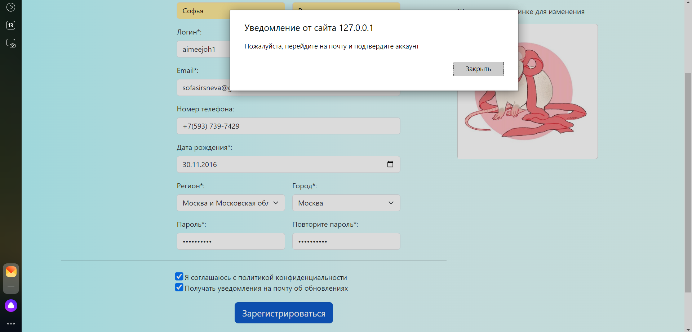
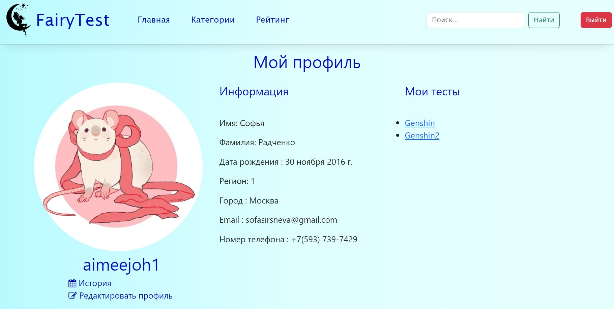
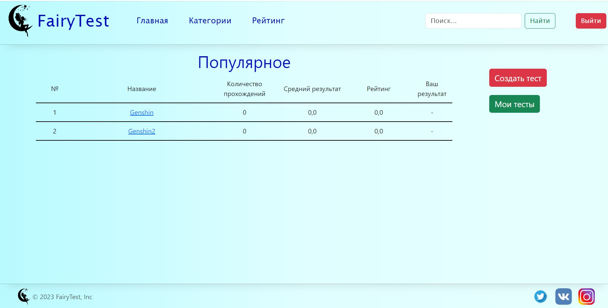

# FairyTest
Сайт для создания и прохождения тестов.
## Описание
Помимо создания и прохождения тестов есть возмжность авторизироваться. Сайт также собирает статистику по тестам и пользователям.

## Стек технологий
Django, PostgreSQL, Docker/Docker Compose
## Запуск
- Развернуть приложение в Docker:
- - Склонировать проект
- - Поменять настройки БД в .env.dev
- - Из корневого каталога запустить файл docker-compose.yml командой `docker-compose up -d`
- - Выполнить миграции:
- - 1) Закомментировать urlpatterns в FairyTail1/urls.py
- - 2) `docker-compose run web python manage.py makemigrations`
- - 3) `docker-compose run web python manage.py migrate`
- - 4) Раскомментировать urlpatterns
- Запустить локально:
- - Склонировать проект
- - Установить все нужные библиотеки `pip install -r requirements.py`
- - Поменять настройки БД в FairyTail1/settings.py (66-75)
- - Выполнить миграции:
- - 1) Закомментировать пути в FairyTail1/urls.py
- - 2) `python manage.py makemigrations` / `python3 manage.py makemigrations` 
- - 3) `python manage.py migrate` / `python3 manage.py migrate`
- - 4) Раскомментировать urlpatterns
- - Запустить приложение `python manage.py runserver` или `python3 manage.py runserver`

